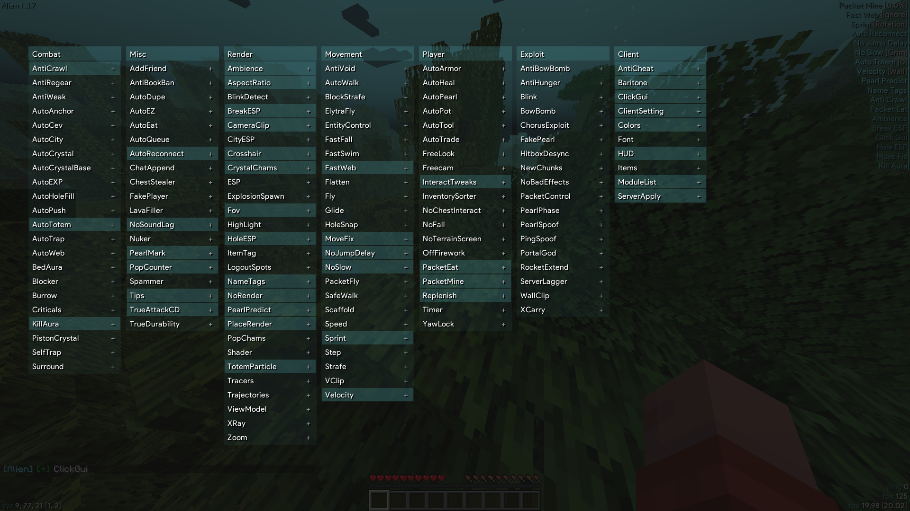

# Supernova Pro

[English](README.md) | [中文](README_CN.md)

A Minecraft 1.20.4 Fabric hacked client for Crystal PvP.

[](https://github.com/bhirapth/Supernova-Pro/actions/workflows/build.yml)
[](https://www.gnu.org/licenses/gpl-3.0)
[](https://www.minecraft.net/)



## Download

**[Latest Release](https://github.com/bhirapth/Supernova-Pro/releases/latest)**

## Features

<details>
<summary><b>Combat</b></summary>

| Module | Description |
|--------|-------------|
| [AutoCrystal](src/main/java/dev/luminous/mod/modules/impl/combat/AutoCrystal.java) | Automated end crystal placement and breaking |
| [AutoCrystalBase](src/main/java/dev/luminous/mod/modules/impl/combat/AutoCrystalBase.java) | Base placement helper for crystal combat |
| [AutoTrap](src/main/java/dev/luminous/mod/modules/impl/combat/AutoTrap.java) | Trap enemies with obsidian |
| [AutoWeb](src/main/java/dev/luminous/mod/modules/impl/combat/AutoWeb.java) | Place cobwebs on enemies |
| [AutoLadder](src/main/java/dev/luminous/mod/modules/impl/combat/AutoLadder.java) | Place ladders near enemies |
| [AutoCity](src/main/java/dev/luminous/mod/modules/impl/combat/AutoCity.java) | Break opponent's obsidian |
| [AutoAnchor](src/main/java/dev/luminous/mod/modules/impl/combat/AutoAnchor.java) | Respawn anchor combat |
| [AutoHoleFill](src/main/java/dev/luminous/mod/modules/impl/combat/AutoHoleFill.java) | Fill holes automatically |
| [PistonCrystal](src/main/java/dev/luminous/mod/modules/impl/combat/PistonCrystal.java) | Piston-based crystal setups |
| [BedAura](src/main/java/dev/luminous/mod/modules/impl/combat/BedAura.java) | Bed placement combat |
| [KillAura](src/main/java/dev/luminous/mod/modules/impl/combat/KillAura.java) | Melee combat automation |
| [Surround](src/main/java/dev/luminous/mod/modules/impl/combat/Surround.java) | Self-trapping with obsidian |
| [Burrow](src/main/java/dev/luminous/mod/modules/impl/combat/Burrow.java) | Hide inside blocks |

</details>

<details>
<summary><b>Player</b></summary>

| Module | Description |
|--------|-------------|
| [AutoGapple](src/main/java/dev/luminous/mod/modules/impl/player/AutoGapple.java) | Auto eat golden apples |
| [AutoArmor](src/main/java/dev/luminous/mod/modules/impl/player/AutoArmor.java) | Auto equip armor |
| [AutoTool](src/main/java/dev/luminous/mod/modules/impl/player/AutoTool.java) | Auto switch tools |
| [AutoMine](src/main/java/dev/luminous/mod/modules/impl/player/AutoMine.java) | Auto mining |
| [AutoPot](src/main/java/dev/luminous/mod/modules/impl/player/AutoPot.java) | Auto splash potions |
| [AutoHeal](src/main/java/dev/luminous/mod/modules/impl/player/AutoHeal.java) | Auto exp bottles |
| [AutoTrade](src/main/java/dev/luminous/mod/modules/impl/player/AutoTrade.java) | Auto villager trading |
| [AutoPearl](src/main/java/dev/luminous/mod/modules/impl/player/AutoPearl.java) | Auto ender pearl throw |
| [Freecam](src/main/java/dev/luminous/mod/modules/impl/player/Freecam.java) | Free camera movement |
| [PacketMine](src/main/java/dev/luminous/mod/modules/impl/player/PacketMine.java) | Fast mining |
| [TimerModule](src/main/java/dev/luminous/mod/modules/impl/player/TimerModule.java) | Game speed control |

</details>

<details>
<summary><b>Movement</b></summary>

| Module | Description |
|--------|-------------|
| [Speed](src/main/java/dev/luminous/mod/modules/impl/movement/Speed.java) | Movement speed boost |
| [Fly](src/main/java/dev/luminous/mod/modules/impl/movement/Fly.java) | Flight |
| [Scaffold](src/main/java/dev/luminous/mod/modules/impl/movement/Scaffold.java) | Auto bridge |
| [Step](src/main/java/dev/luminous/mod/modules/impl/movement/Step.java) | Step height increase |
| [Velocity](src/main/java/dev/luminous/mod/modules/impl/movement/Velocity.java) | Knockback reduction |
| [Sprint](src/main/java/dev/luminous/mod/modules/impl/movement/Sprint.java) | Auto sprint |
| [HoleSnap](src/main/java/dev/luminous/mod/modules/impl/movement/HoleSnap.java) | Teleport to holes |

</details>

<details>
<summary><b>Render</b></summary>

| Module | Description |
|--------|-------------|
| [ESP](src/main/java/dev/luminous/mod/modules/impl/render/ESP.java) | Entity highlighting |
| [HoleESP](src/main/java/dev/luminous/mod/modules/impl/render/HoleESP.java) | Hole visualization |
| [Tracers](src/main/java/dev/luminous/mod/modules/impl/render/Tracers.java) | Entity tracers |
| [NameTags](src/main/java/dev/luminous/mod/modules/impl/render/NameTags.java) | Enhanced name tags |
| [CrystalChams](src/main/java/dev/luminous/mod/modules/impl/render/CrystalChams.java) | Crystal chams |
| [XRay](src/main/java/dev/luminous/mod/modules/impl/render/XRay.java) | Block ESP |
| [Shader](src/main/java/dev/luminous/mod/modules/impl/render/Shader.java) | Post-processing effects |

</details>

<details>
<summary><b>Exploit</b></summary>

| Module | Description |
|--------|-------------|
| [Blink](src/main/java/dev/luminous/mod/modules/impl/exploit/Blink.java) | Packet freeze |
| [PearlPhase](src/main/java/dev/luminous/mod/modules/impl/exploit/PearlPhase.java) | Phase through blocks |
| [WallClip](src/main/java/dev/luminous/mod/modules/impl/exploit/WallClip.java) | Clip through walls |
| [XCarry](src/main/java/dev/luminous/mod/modules/impl/exploit/XCarry.java) | Carry items in containers |

</details>

## Requirements

- Minecraft 1.20.4
- Fabric Loader 0.15.7+
- Java 17+

## Build

```bash
git clone https://github.com/bhirapth/Supernova-Pro.git
cd Supernova-Pro
./gradlew build
```

The built jar will be in `build/libs/`.

## Credits

- [Aoba-MC-Hacked-Client](https://github.com/coltonk9043/Aoba-MC-Hacked-Client)
- [ThunderHack-Recode](https://github.com/Pan4ur/ThunderHack-Recode)
- [Meteor Client](https://github.com/MeteorDevelopment/meteor-client)
- [Baritone](https://github.com/cabaletta/baritone)
- [Satin](https://github.com/Ladysnake/Satin)
- [lookaround](https://github.com/qualterz/lookaround)

## License

[GNU General Public License v3](LICENSE)
